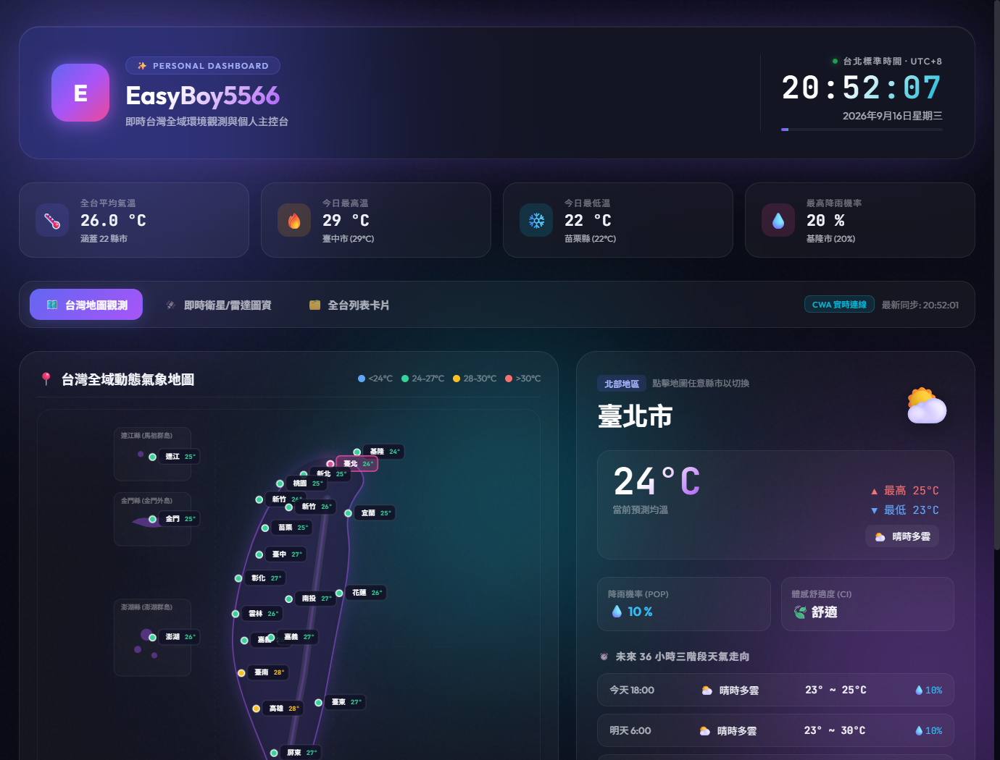

# L2web - 個人即時儀表板 & 全台氣象觀測

本專案為課堂實作項目，結合現代前端玻璃擬態（Glassmorphism）動態設計，串接台灣交通部中央氣象署（CWA）Open Data API，提供全台 22 縣市即時天氣溫度與台北即時標準時鐘。

---

## 📌 課程資訊

- **課程名稱**：AIoT與數據分析
- **課堂實作**：DIC-1
- **學生/開發者**：EasyBoy5566
- **示範網站**：[https://easyboy5566.github.io/L2web/](https://easyboy5566.github.io/L2web/)
- **資料庫程式碼**：[https://github.com/EasyBoy5566/L2web](https://github.com/EasyBoy5566/L2web)

---

## 📸 頁面截圖展示

---

## 🌟 功能特色

1. **台北標準時間（Asia/Taipei UTC+8）**
   - 毫秒級即時時鐘更新
   - 包含秒數動態進度條與呼吸狀態燈

2. **中央氣象署（CWA）官方 API 實時串接**
   - 串接 `F-C0032-001` 三十六小時天氣預報開放資料
   - 即時計算全台平均氣溫、最高溫縣市、最低溫縣市及降雨機率最高地區

3. **全台 22 縣市詳細氣象卡片**
   - 當前平均氣溫、最高溫與最低溫區間
   - 天氣現象動態圖示（晴天、多雲、短暫陣雨、雷雨等）
   - 降雨機率（PoP）與體感舒適度評級（CI）
   - 未來 36 小時（三個預報時段）詳細趨勢預測

4. **地區篩選與即時搜尋**
   - 支援分區快速切換：全台 (22)、北部 (7)、中部 (6)、南部 (3)、東部 (3)、離島 (3)
   - 支援縣市名稱即時搜尋過濾

5. **現代視覺設計**
   - 採用 Dark Mode 深色玻璃擬態（Glassmorphism）質感
   - 背景三色動態平滑光暈動畫與顆粒感紋理
   - 響應式佈局（支援桌面、平板與手機螢幕）

---

## 🚀 技術棧

- **HTML5 / CSS3**：原生 Vanilla CSS，自定義漸層、動態特效與響應式 Grid/Flexbox 佈局
- **JavaScript (ES6+)**：非同步 Fetch API、即時 Date 物件處理、動態 DOM 渲染
- **數據來源**：[交通部中央氣象署氣象資料開放平臺](https://opendata.cwa.gov.tw/)
- **字型**：Google Fonts (Outfit, JetBrains Mono, Noto Sans TC)
- **部署平台**：GitHub Pages
